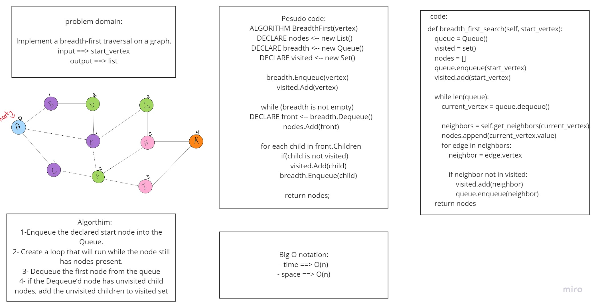
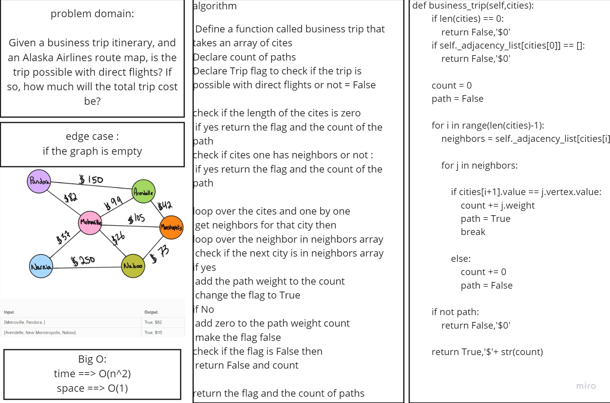

# Code Challenge 36 | breadth-first traversal
- Implement a breadth-first traversal on a graph.


## Whiteboard Process


## Approach & Efficiency
- time ==> O(n)
- space ==> O(n)

## Solution
```
    def breadth_first_search(self, start_vertex):
        queue = Queue()
        visited = set()
        nodes = []
        queue.enqueue(start_vertex)
        visited.add(start_vertex)

        while len(queue):
            current_vertex = queue.dequeue()

            neighbors = self.get_neighbors(current_vertex)
            nodes.append(current_vertex.value)
            for edge in neighbors:
                neighbor = edge.vertex

                if neighbor not in visited:
                    visited.add(neighbor)
                    queue.enqueue(neighbor)
        return nodes

```
https://github.com/jariryyousef/data-structures-and-algorithms/pull/45


# Code Challenge 37 | Graph business trip
- Given a business trip itinerary, and an Alaska Airlines route map, is the trip possible with direct flights? If so, how much will the total trip cost be?


## Whiteboard Process


## Approach & Efficiency
- time ==> O(n^2)
- space ==> O(1)

## Solution
```
    def business_trip(self,cities):
            if len(cities) == 0:
                return False,'$0'
            if self._adjacency_list[cities[0]] == []:
                return False,'$0'

            count = 0
            path = False

            for i in range(len(cities)-1):
                neighbors = self._adjacency_list[cities[i]]

                for j in neighbors:

                    if cities[i+1].value == j.vertex.value:
                        count += j.weight
                        path = True
                        break
                    
                    else:
                        count += 0
                        path = False
            
            if not path:
                return False,'$0'
            
            return True,'$'+ str(count)
```
https://github.com/jariryyousef/data-structures-and-algorithms/pull/46
