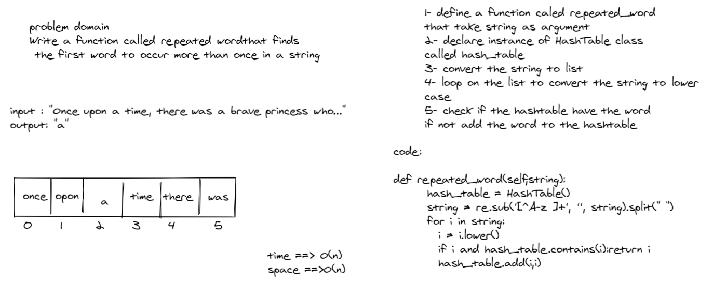

# Hashtables
A hash table is a special collection that is used to store key-value items. So instead of storing just one value like the stack, array list and queue, the hash table stores 2 values. These 2 values form an element of the hash table

## Challenge
- Implement a Hashtable Class with the following methods:

- add  
  Arguments: key, value  
  Returns: nothing  
  This method should hash the key, and add the key and value pair to the table, handling collisions as needed.  

- get  
  Arguments: key  
  Returns: Value associated with that key in the table  

- contains  
  Arguments: key  
  Returns: Boolean, indicating if the key exists in the table already.  

- hash  
    Arguments: key  
    Returns: Index in the collection for that key  

## Approach & Efficiency  
- space ==> O(n)
- time ==> O(1)

## API

- hash:  
    Arguments: key  
    Returns: Index in the collection for that key  

- add:  
  Arguments: key, value  
  Returns: nothing  

- get:  
  Arguments: key  
  Returns: Value associated with that key in the table  

- contains:  
  Arguments: key  
  Returns: Boolean


https://github.com/jariryyousef/data-structures-and-algorithms/pull/37

# Code Challenge 31 | Hashmap Repeated Word
- Find the first repeated word in a book.


## Whiteboard Process


## Approach & Efficiency
- time ==> O(n)
- space ==> O(n)

## Solution
```
    def repeated_word(self,string):
      hash_table = HashTable()
      string = re.sub('[^A-z ]+', '', string).split(" ")
      for i in string:
        i = i.lower()
        if i and hash_table.contains(i):return i
        hash_table.add(i,i)

```
https://github.com/jariryyousef/data-structures-and-algorithms/pull/39