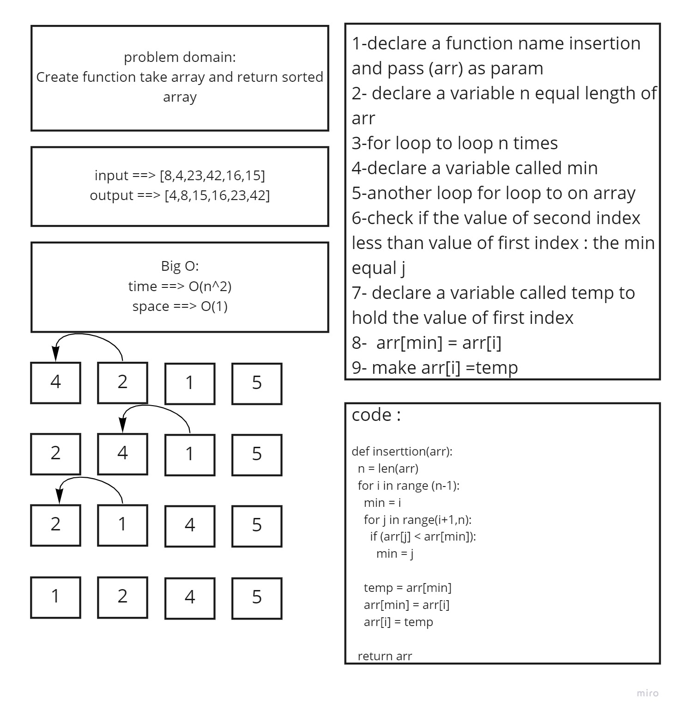

 ## Insertion Sort
 
 - [X] Top-level README “Table of Contents” is updated
 - [X] README for this challenge is complete
       - [X] Summary, Description, Approach & Efficiency, Solution
       - [X] Picture of whiteboard
       - [X] Link to code
 - [X] Feature tasks for this challenge are completed
 - [X] Unit tests written and passing
       - [X] “Happy Path” - Expected outcome
       - [X] Expected failure
       - [X] Edge Case (if applicable/obvious)

## Whiteboard Process

## Approach & Efficiency
- time ==> O(n^2)
- space ==> O(1)