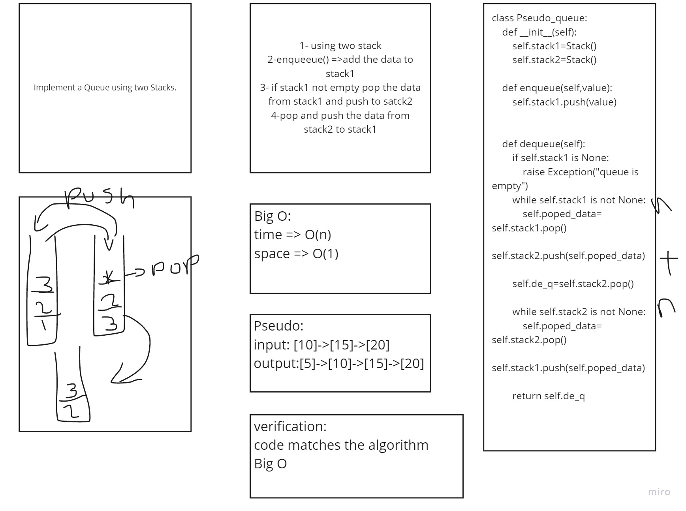

- [x] Create a new class called pseudo queue
- [x] Instead, this PseudoQueue class will implement our standard queue interface (the two methods listed below),
- [x] enqueue method: Inserts value into the PseudoQueue, using a first-in, first-out approach.
- [x] dequeue method: Extracts a value from the PseudoQueue, using a first-in, first-out approach.h

# Challenge Summary
- Create a new class called pseudo queue.

## Whiteboard Process

## Approach & Efficiency
- Big O:  
    time => O(n)  
    space => O(1)

## Solution
when enqueue push item to stack1.  
when dequeue move data from stack1 to stack2 => pop from stack1 -> move elements from stack2 to stack1