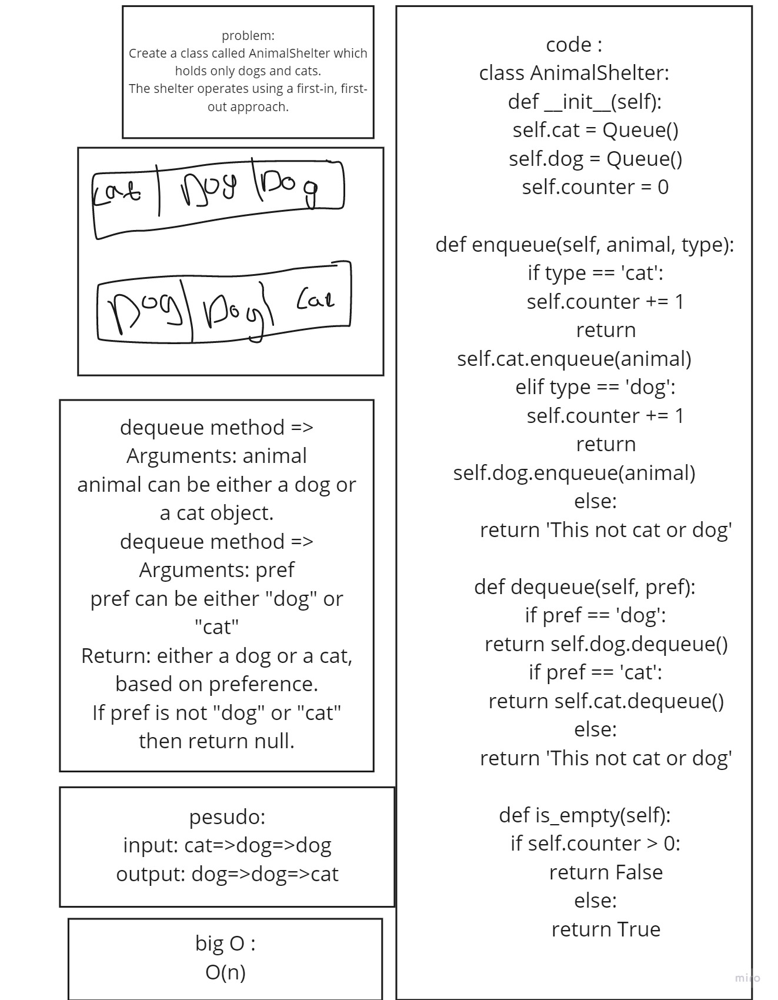

https://github.com/jariryyousef/data-structures-and-algorithms/pull/21 
# Challenge Summary
## stack-queue-animal-shelter

## Whiteboard Process

## Approach & Efficiency
Big O (1)

## API
- enqueue
- dequeue 
- is_empty